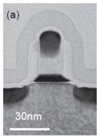
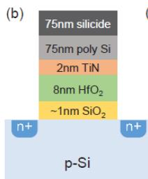
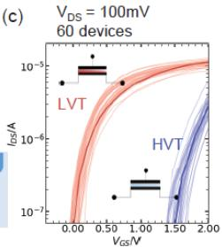
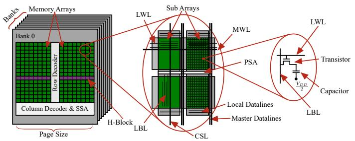
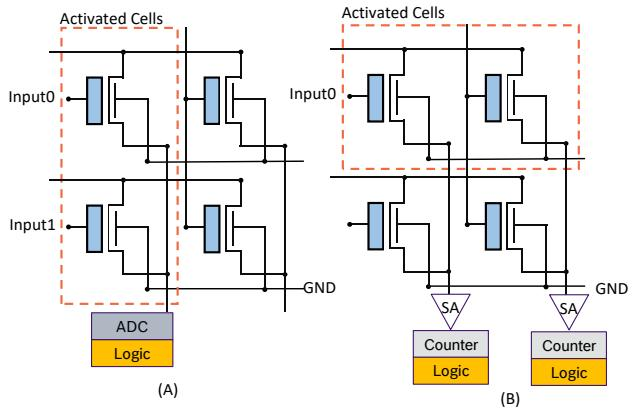
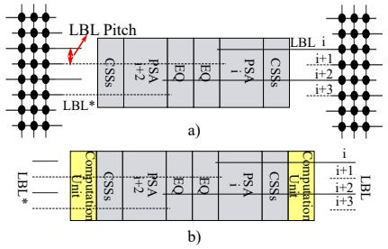
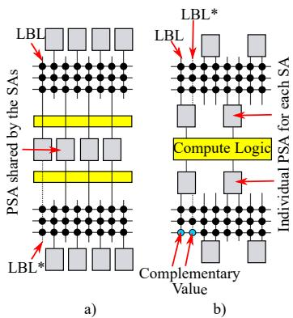

# [[FeFET]] versus DRAM based [[PIM]] Architectures: A Comparative Study

Chirag Sudarshan∗†, Taha Soliman∗‡, Thomas Kampfe ¨ §, Christian Weis†, Norbert Wehn†

† University of Kaiserslauten, Kaiserslauten, Germany

Email: {sudarshan,weis,wehn}@eit.uni-kl.de

‡ Robert Bosch GmbH, Renningen, Germany

Email: Taha.Soliman@de.bosch.com

§ Fraunhofer IPMS, Center Nanoelectronic Technologies (CNT), Dresden, Germany

Email: thomas.kaempfe@ipms.fraunhofer.de

Abstract—The throughput and energy efficiency of computecentric architectures for memory intensive Deep Neural Networks (DNN) applications are limited by memory bound issues like high data-access energy, long latencies, and limited bandwidth. Processing-in-Memory (PIM) is a very promising approach to address these challenges and bridge the memory-computation gap. PIM places computational logic inside the memory to exploit minimum data movement and massive internal data parallelism. There are currently two PIM trends: 1) Use of emerging non-volatile memories to perform highly parallel analog computation of MAC operations and implicit storage of weights within the memory arrays, and 2) exploiting mature memory technologies that are enhanced by additional logic to enable efficient computation of MAC operations near the memory arrays. In this paper, we will compare both trends from an architectural perspective. Our study mainly emphasizes on FeFET memories (an emerging memory candidate) and DRAM memories (a mature memory candidate). We will highlight the major architectural constraints of these memory candidates that impact the PIM designs and their overall performance. Finally, we will assess feasible choice of candidate for different computations or DNN task types.

Index Terms—Processing in Memory, DRAM, FeFET, DNN

# I. INTRODUCTION

Emerging applications, such as Deep Neural Networks (DNN), are data-driven and memory intensive. The computation of these applications on compute-centric standard processing systems results in reduced throughput and energy efficiency due to memory-bound issues like high data-access energy, long latencies, and limited bandwidth [1]. One of the trending approaches to address memory-bound issues is Processing-in-Memory (PIM), which is widely researched by both academia and industry. PIM places computational logic inside the memory to exploit minimum data movement and massive internal data parallelism to achieve high throughput and more importantly, very high energy efficiency. For example, the current roadmap for PIM accelerators is to achieve a superior energy efficiency of 10000 TOPS/W [2], while conventional accelerators like Google TPU only achieve a peak efficiency of 2 TOPS/W [3].

PIM architectures exist for both mature memory technology (e.g. SRAM and DRAM) and emerging non-volatile memory technology (e.g. [[RRAM]], FeFET, PCM). However, the design

approaches and target use-cases are very different for both technology types. This paper presents a comparative architectural study of mature memory and emerging memorybased PIM. We consider DRAM as the mature memory candidate and FeFET as the emerging memory candidate in our study.

The computation kernel in DNN is Multiply-Accumulate (MAC). In FeFET-PIM, this operation is implemented inside the memory arrays by exploiting the implicit analog property of the arrays. One of the advantages of FeFET technology is its compatibility with Front-End-Of-Line (FEOL) integration into standard CMOS technology. Hence, the FeFET-based accelerator core can replace conventional MAC cores in standard computation platforms. The commodity DRAM technology is different in comparison to standard CMOS technology, which consists of specialized buried gate RCAT or SRCAT cell access transistors, stacked cylindrical cell capacitors, etc. This results in a challenging implementation of MAC operations within the existing commodity DRAM architectures. These architectures are dominated by the area, density and yield optimized memory arrays and do not explicitly contain computation units apart from the peripheral logic for data accesses. In this context, the most feasible approaches are to integrate the peripheral transistor based MAC units near the memory array or near the bank IO region that does not modify the specialized storage blocks. One of the main advantages of DRAM-PIM memory devices is the implicit support of dual-mode that enable concurrent operation as both a high density main memory and an energy efficient computation. DRAM-PIM also enables the offloading of computations to its data storage locations, i.e. main memory devices, without having to first prefetch the data from external devices to accelerator cores. In summary, the diverse approaches of these two memory types require a detailed comparison in order to pave the future research directions towards a successful mainstream adaption of PIM.

In this paper, we first investigate the architectural approaches, computation unit location, and the various challenges of FeFET-PIM (Section III) and DRAM-PIM (Section IV). Our investigations are based on the extensive study of state-of-the-art DRAM and FeFET-PIM publications that emphasize on DNNs. Further, this is the first publication

to present a comparison of these two candidates considering several hardware design factors, such as architectural choices, endurance, device variation, impact of write/read energy, underlying technology limitations, and other circuit level considerations. Finally, this paper identifies the target use-case and suitable DNN tasks for each candidate.

# II. BACKGROUND

This section reviews the FeFET and DRAM basics.

# A. FeFET

Despite the fact that the [[ferroelectric]] field-effect transistor (FeFET) was a concept that dates already back to the 70s, it is not until recently that the device became a viable technology. With the discovery of ferroelectric [[HfO2]] thin films, its scalable integration into advanced CMOS processes became possible [4], [5]. FeFET devices are currently implemented in the 28 nm bulk [6] and 22 nm FDSOI [7] technology nodes. However, several studies show the scalability of the device beyond 22nm [7] and towards 7nm nodes [8].

  
Fig. 1. (a) TEM of FeFET device (b) FeFET device material stack (c) FeFET device transfer characteristics of the LVT / HVT states. [9]

The polarization state of the ferroelectric layer in the FeFET device defines the transistor characteristics and consequently the threshold voltage $V _ { t h }$ . As shown in Fig. 1.(c), the FeFET device is programmed into one of two states of low $V _ { t h }$ (LVT) or high $V _ { t h }$ (HVT). These polarization states allow for the usage of FeFET devices as an emerging non-volatile memory. The FeFET device shows very high data retention (> $1 0 ^ { \dot { 8 } } s$ at $1 2 5 ^ { \circ } C )$ and a very high on/off current ratio $( > 1 0 ^ { 5 } )$ in the case of two state devices [5]. Additionally, FeFETs can also be programmed in more than two states by applying write pulses with the increasing magnitude [10].

# B. DRAM

A DRAM device is organized as a set of banks that include memory arrays, as shown in Figure 2. Each bank consists of row and column decoders, Master Wordline (MWL) drivers, and Secondary Sense Amplifiers (SSAs). The memory array is designed as a hierarchical structure of Sub-Arrays (SAs) (e.g. 1024×1024 cells). To access the data from DRAM, an activate command (ACT) is issued to a specific row, which activates the associated Master Wordline Driver (MWLD) and Local Wordline Drivers (LWLDs). This initiates the charge sharing between the memory cells and the respective Local Bitlines (LBLs) in the SA. The voltage difference between the LBLs

  
Fig. 2. DRAM Device Architecture.

and reference LBLs from the neighboring SA is sensed by the Primary Sense Amplifiers (PSAs) integrated in each SA (E.g. 1024 bit of data). The concurrently sensed data by the PSAs of all the SA in a H-Block (i.e., row of SA) creates an illusion of a large row buffer or a page (e.g., Page size = 2KB). Please note that the PSAs are shared by the neighboring SAs/H-Blocks in an open bit-line DRAM architecture. After row activation, read (RD) or write (WR) commands are issued to specific columns of this logical row buffer using Column Select Lines (CSL) to access the data via Master Bitlines (MBLs) by the SSAs. In order to activate a new row in the same bank, a precharge (PRE) command has to be issued to equalize the bitlines and to prepare the bank for a new activation. Reading or writing the data from/to the PSAs of a block (or page) to SSAs is performed in a fixed granularity of I/O data width × bursts length (e.g. 16 × 8 = 128 bit in DDR4).

# III. FEFET-BASED PIM

The advancements in FeFET device properties highlighted in Section II-A led to several FeFET-based PIM architectures to be published in recent years [2], [11]–[14]. The general idea of these architectures is, that the DNN weights are stored in the memory array as LVT or HVT state representing Logic-1 or Logic-0 respectively. The FeFET device performs an AND logic operation between the stored bit and the applied input to the device, which represents the input feature in case of DNN. The results of this operation are represented by the drain current.

Unlike other emerging memory technologies such as the two-terminal devices MRAM and RRAM, in many of the presented FeFET PIM [[crossbar]]s, the memory cell does not require an access transistor due to the three-terminal nature of the FeFET [15]. This in addition to the aforementioned FeFET properties of high/on off ratio make the FeFETs a potential candidate for low power PIM architectures. Nevertheless, the FeFET device suffers from a major drawback related to the high write voltage (4V) compared to other eNVMs [16].

To construct FeFET-based PIM architectures, two main approaches are currently pursued. As shown in Fig. 3.(A), the first approach is similar to classic PIM mixed-signal processing, where the memory cell performs an AND or multiplication operation and the resulting current is accumulated. This configuration requires an analog-to-digital converter (ADC) for further processing in digital logic, as implemented in [11], [13]. The second approach is shown in Fig. 3.(B) where the crossbar performs a single operation

  
Fig. 3. (a) Mixed-signal FeFET based PIM (b) Digital FeFET based PIM.   
Fig. 4. PSA floorplan of conventional vs. with computation unit for PIM. a) Conventional PSA region, b) example computation unit integration in the PSA region, where metal tracks have to be reserved in the computation unit for LBL and reference LBL (LBL*) to be connected to respective PSA.

that is afterward sensed by the attached Sense Amplifiers (SA) as implemented in [14], [17]. The results are usually accumulated and counted until the final results are similar to ADC’s results (i.e. first configuration) for further processing. Hence, this approach requires several clock cycles to compute the target operation, compared to the mixed-signal approach which requires a single cycle.

The mixed-signal FeFET PIMs offer several advantages by leveraging the sum of the FeFETs drain currents to perform the accumulation operation. This can allow for a very high throughput. However, this architecture requires the usage of power expensive ADCs which can compromise the crossbar performance. Furthermore, the analog operations are very prone to the FeFET device variability, which can impact the drain current. This variability can directly reduce the inferred network accuracy and require additional training or compensation hardware to maintain the targeted accuracy [18].

On the other hand, digital approaches try to overcome the variability related problems as well as the ADC related overheads. This configuration allows for higher operating frequency while performing the AND operation using the memory cells. However, replacing the analog addition with a counter after the SA can decrease the block throughput. For example, this approach yielded 4 MAC/Cycle [14] compared to 8 MAC/Cycle [2] in case of analog approach.

As mentioned in the Introduction section, the challenge of DRAM-PIM is the placement of computation units within the commodity DRAM architectures due to incompatible technology. The state-of-the art DRAM-PIM publications have proposed architectures that integrate the computation units 1) Inside SA, 2) Near SA or in PSA region, 3) Bank peripheral region and 4) IO region. ”Inside $\mathbf { S A } ^ { \prime \prime }$ architectures [19]–[23] proposed a new special rows within SA, with Dual Contact cells (DCC), two transistors per cell and additional interconnection between the special rows for computation operation. This leads to the complex modification of the optimized, buried gate SRCAT transistor-based, $6 \mathrm { F ^ { 2 } }$ DRAM SA physical design, which has a major impact on yield and has to be avoided. The ”Near $\mathbf { S A } ^ { \prime \prime }$ approach [24]– [27] integrates computation units at the output of the PSA without modifying the SA design. Unlike SA, the PSA region’s physical design is using planar peripheral transistors that enable the integration of new computation units, but with certain restrictions. Figure 4 compares the floorplans of the conventional Open BitLine (OBL) SA architecture’s PSA region in 4a (i.e., including the column select block (CSS) and equalizer block (EQ)) and the PSA region modifications for PIM in 4b. The new computation units integrated near the SA have to reserve the metal tracks to allow the interconnection of fine pitch LBLs and the respective PSAs. This results in challenging routing within the new computation unit due to the very limited number of metal layers (e.g., three or four) in DRAM technology. The increase of LBL length due to new computation units has an adverse impact on the sensing operation of PSA, if the height of the computation unit is beyond the design considerations. Hence, it is challenging to integrate the area intensive multipliers and adders in the PSA region. Although, PSA region delivers the large amount of parallel data for computation (i.e. 1024 bits per SA or 2KB per page), the memory vendor’s [28]–[32] approach is to integrate the computation units in the bank peripheral region. The physical restrictions of this region are much lower compared to the PSA region and inside SA, which enables the seamless integration of computation unit without modifying the DRAM bank core design. This approach was silicon proven by Samsung [28] and Hynix [32]. However, the available data bits per cycle of computation is reduced to a maximum of 256 bits (i.e., equal number of MBLs or #MBLs). As a result, the computational throughput of each bank in this approach is saturated by the available amount of data per cylce and the data access latency within the DRAM bank. These values depend on several design factors, such as SSA area, bank height, and operating frequency. The peak computation throughput is alternatively increased by increasing the number of parallel operating banks, but the power budget limitations of DRAMs sets the upper bound for the active number of computation banks. A typical power consumption of HBM DRAMs is in the range of 3-4 W [33]. Samsung presented the power results for the PIM with 32 banks per die or 128 banks per stack to be approximately consuming the same power as conventional

  
Fig. 5. Comparing DRAM BitLine array architectures from PIM perspective: a) Open BitLine with new compute logic, b) Quasi BitLine (QBL) with new compute logic. QBL elimination the PSA sharing and enabling integration of large computation unit in the PSA region.

counterparts. Under these circumstances, the increase of the number of active computation banks requires the modification of the power network, thermal analysis, retention analysis, heat dissipation through stacked dies, and package considerations. Hence, saturating or slowing the further scaling of active computing banks, which limits the peak throughput and energy efficiency scaling. The IO region has the lowest physical restrictions, but in addition to reduced data parallelism, it also requires 3× higher energy for data access as compared to within the bank [34]. Hence, memory vendor architectures like Hynix-AiM proposed to employ this region only for the large shared global buffers that are used for the bank to bank communication. Overall, for the sake of throughput scalability, it is important to explore innovative architectures that integrate the computation units in the PSA region. Another major advantage of the PSA region is the minimal data movement, which further increases the energy efficiency.

One of the recent academic publications [35] proposed to integrate the analog computation based MAC units in the PSA region that is low area and suffice the constraints of this region. Their effective partitioning also enabled the integration of area intensive ADCs in the peripheral region without compromising on the advantages available in the PSA region. However, this approach is confined to DNN inference and is not suitable for DNN training that requires floating-point computation. Hence, the authors of [36] proposed Quasi Open Bitline (QBL) SA architecture, as shown in Figure 5. This approach reuses the OBL array but eliminates the PSA sharing by considering the LBL and reference LBL (LBL*) from the same array, which uses two DRAM cells for a single data. Hence, creating the desired space between the SAs for the new computation logic with low physical restrictions. QBL does not require any major modifications to the OBL SA or its PSA design, but only requires a minor interconnection modification, i.e., LBL to PSA. The capacity loss by QBL can be compensated by designing OBL-based banks specifically for storage. However, a detailed architectural exploration and comparison of the computation unit placement locations has to be performed by future research with post silicon analysis of these novel approaches.

TABLE I DEVICE-LEVEL COMPARISON OF FEFET AND DRAM FOR THE TECHNOLOGY NODE 28 nm [37] AND 17 nm [38], RESPECTIVELY.   

<table><tr><td>Parameter</td><td>FeFET</td><td>DRAM</td></tr><tr><td>Technology node</td><td>28 nm</td><td>17 nm (1y nm)</td></tr><tr><td>Type</td><td>Non-volatile</td><td>Volatile</td></tr><tr><td>Maturity</td><td>Emerging</td><td>Mature</td></tr><tr><td>Logic technology compatibility</td><td>Yes</td><td>No</td></tr><tr><td>Cell size</td><td>0.01 ~ 0.25μm2</td><td>0.0023μm2</td></tr><tr><td>Density</td><td>0.050 Gb/mm2</td><td>0.241 Gb/mm2</td></tr><tr><td>Retention time</td><td>108 @ 80°C</td><td>16-64 ms</td></tr><tr><td>Programming/Write voltage</td><td>4-6 V</td><td>VDD</td></tr><tr><td>Endurance</td><td>105</td><td>&gt;1016</td></tr></table>

# V. COMPARISON

This section compares the FeFET-PIM with DRAM-PIM on three folds. First, device-level comparison and its impact on DNN tasks from a PIM perspective. Second, we differentiate the two memory candidates in terms of their suitable usecases and tasks. Finally, we present the architectural level comparison.

Table I presents the device-level comparison of nonvolatile, emerging, FeFETs and volatile, mature, DRAMs. One of the major advantages of emerging FeFET memories is their compatibility with CMOS logic technology. This enables the replacement of the standard MAC cores with the high energy efficient FeFET crossbar-based mixed signal MAC cores in standard CMOS technology based computation architectures. The authors of [2] showed that their 22 nm FeFET MAC core consumed an energy of 4.67 fJ/MAC for 8-bit precision, while a 7 nm standard counterpart consumed 14 fJ/MAC [39]. Contrarily, the DRAM technology is different from CMOS logic technology and is specialized for high density storage, with separate transistors for storage cell and peripheral logic. Hence, in contrast to the replacement approach of FeFETs, the MAC units in DRAM-PIM have to match the commodity DRAM architecture and have to be integrated within the technology constraints. Hence, implicitly supporting dual-mode feature, i.e. high density memory enhanced energy efficient accelerator. For example, Samsung designed a PIM accelerator with 6 GB capacity and 1.2 TOPS throughput [28]. Hence, the dual-mode feature aligns with the current roadmap of the DRAM memories and is appealing from the business point of view for DRAM vendors, as it extends the functionality of DRAMs and their market.

One of the critical concerns of the emerging FeFET memories is the large cell size, low density, and low capacity in comparison to mature memories like DRAM. A typical FeFET array dimensions is 256 × 256 and the capacity ranges between 64 Mb to 128 Mb for PIM architectures [13], [14]. As a result, these memories are currently not suitable for networks with a large footprint like VGG16, LSTM, etc. The stateof-the-art FeFET-PIM like [13], [14] implemented inference tasks with low memory footprint networks like SqueezNet, ResNet20, etc. that align with their memory capacity (i.e. 128 Mb). The DRAMs on the other hand have proven their capacity up to 16 Gb per die [40] and are suitable for most of the current DNN networks. The DRAM technology has scaled well over the years and targets to reach a cell size of $0 . 0 0 0 6 9 \mu m ^ { 2 }$ by 2030 [41] (i.e. 4× smaller than 17 nm),

which makes it a promising candidate for future high memory footprint networks.

The volatility, retention time, and write energy have a direct impact on the type of the task the PIM architecture can perform. In FeFETs, the write operation requires high voltage (i.e. 4 V) input pulse to be applied for a longer time (i.e. 100 ns) than the read pulse (i.e. < 10 ns on an average) as shown in [42], [43]. Hence, severely impacting the performance of training tasks due to the continuous weight updates. As a result, most of the FeFET-PIM architectures predominantly focus on inference tasks. The weight parameters are required to be stored only once in the array and are reused for all the input feature map data without any additional write operations. The non-volatility and long retention time of the FeFET array further incline the architectural decisions in favor of the inference task. The low endurance of FeFET is another major factor that inhibits the FeFET to be used for training task where the continuous weight updates reduce the life span for the PIM accelerator.

On the other hand, DRAMs have approximately same energy and latency for write and read operation that makes the DRAM device a strong candidate for both inference and training task. The high density of the DRAMs also allows for the storage of both data and weights inside the same memory die, unlike FeFETs that store intermediate data inputs in an additional memory. This avoids the access of data from a separate memory and its high energy consumption. For example, a 64-bit data access from an 1 MB SRAM consumes an energy of 14 pJ and 450 pJ from HBM DRAM [39], while the 8-bit FeFET MAC operation require only 4.67 fJ [2]. However, the low retention time can lead to additional power consumption for refresh operation. All the cells of the DRAM has to be refreshed once every 16-64 ms depending on the DRAM type and operating temperature. The energy consumption of refresh operation can be as high as 50% of the total DRAM energy [44]. However, accessing the data or weights in the DRAM using ACT operations implicitly refreshes the cells. As a result, the refresh operation is avoided if all the weights and the input feature map data are accessed at least once within the retention time. For example, a network with 100 MB parameters has to ensure the throughput of 16 GOPS for 16 ms retention time in case of inference task. Also, the volatile nature of the DRAM leads to an overhead of loading the required weights at every device startup. In addition to the aforementioned challenges, the energy consumption of a MAC operation in DRAM using a peripheral transistor can be up to ≈ 1 pJ [25], which is much higher than FeFET counterparts. The true advantage of DRAMs, in addition to dual-mode, is for the tasks that require higher memory footprints and avoiding frequent high energy (450 pJ per 64-bit [39]) external transfer of data. Most DRAM-PIM publications have focused on inference tasks, but the long term goal is towards the training tasks [45], [46]. The design of floating point MAC from the memory vendor PIM publications [28], [32] additionally supports this goal.

Table II compares some of the recent FeFET and DRAM based PIM architectures. The FeFET-PIM architectures were

TABLE II COMPARISON OF FEFET AND DRAM BASED PIM ARCHITECTURES.   

<table><tr><td rowspan="2"></td><td colspan="2">FeFET</td><td colspan="3">DRAM</td></tr><tr><td>[14]</td><td>[13]</td><td>[28]</td><td>[32]</td><td>[35]</td></tr><tr><td>Process</td><td>28nm</td><td>22nm</td><td>20nm</td><td>1ynm</td><td>2ynm</td></tr><tr><td>Capacity</td><td>128Mb</td><td>64Mb</td><td>4Gb a</td><td>4Gb a</td><td>8Gb a</td></tr><tr><td>No. banks or PE cluster</td><td>2048</td><td>1024</td><td>32</td><td>16</td><td>8 b</td></tr><tr><td>Page Size</td><td>256</td><td>256</td><td>2KB</td><td>2KB</td><td>2KB</td></tr><tr><td>Operation precision</td><td>INT8</td><td>INT8</td><td>FP16</td><td>BF16</td><td>INT8</td></tr><tr><td>Core frequency [MHz]</td><td>2000</td><td>500</td><td>300</td><td>1000</td><td>250</td></tr><tr><td>Area [mm2]</td><td>49.6</td><td>4.9</td><td>84.4</td><td>33.6</td><td>83.85</td></tr><tr><td>Power [W]</td><td>18.2</td><td>0.06</td><td>-</td><td>-</td><td>0.756</td></tr><tr><td>Peak Perf [TOPS/die] c</td><td>16.38</td><td>2.05</td><td>153.6</td><td>256</td><td>0.1428</td></tr><tr><td>GOPS/bank</td><td>8</td><td>2</td><td>4.8</td><td>16</td><td>23.813</td></tr></table>

a per die   
b 6 banks for computation banks and 2 banks for temporary data storage   
c For fair comparison, 1 operation = 1 MAC. [28] and [32] TOPS results are converted accordingly. E.g. TOPS calculation of [28] = 300 MHz ×32 × 16 (32 PCUs per die, 16 MUL and ADD units per PCU or 16 MACs per PCU).

designed to be compatible with standard compute systems, while the DRAM-PIM architectures were designed to be compatible with commodity DRAMs and support dual-mode. Hence, it is difficult to perform a fair comparison at the architectural level. For example, FeFET has the advantage of high parallelism with up to 2048 Processing Element (PE) clusters, but the DRAM parallelism is limited to ≈ 32 banks.

# VI. CONCLUSION

In this paper, we present for the first time a comparative study of the emerging FeFET memory based PIM and the DRAM-based PIM, with an emphasis on DNN applications. We elaborated various PIM architectural approaches and the underlying challenges of these two devices. Further, we compared the device-level parameters of these two candidates and presented a detailed discussion on their impact on architectural decisions. In summary, FeFET have shown superior energy efficiency for MAC operations, but current FeFET-PIM has to focus on optimizing the array dimensions for further increase in parallelism and reduce influence of device variation. In case of DRAM-PIM, the dual-mode is the biggest advantage, but the placement of MAC units within the commodity DRAM architecture is challenging and has to be explored by future research for continuous scaling of throughput and energy efficiency in comparison to FeFET.

# ACKNOWLEDGMENT

This work was partly funded by the German ministry of education and research (BMBF) under grant 16KISK004 (Open6GHuB), Carl Zeiss foundation under grant “Sustainable Embedded AI” and EC under grant 952091 (ALMA), and the ECSEL Joint Undertaking project TEMPO in collaboration with the European union’s H2020 Framework Program (H2020/2014-2020) and National Authorities, under grant agreement number 826655.

# REFERENCES

[1] N. P. Jouppi, et al. In-Datacenter Performance Analysis of a Tensor Processing Unit. In Proceedings of the 44th Annual International Symposium on Computer Architecture, ISCA ’17, pages 1–12, New York, NY, USA, 2017. ACM.

[2] T. Soliman, et al. Ultra-Low Power Flexible Precision FeFET Based Analog In-Memory Computing. In 2020 IEEE International Electron Devices Meeting (IEDM), pages 29.2.1–29.2.4, 2020.   
[3] Google. Edge TPU performance benchmarks.   
[4] T. Boscke et al. ¨ Ferroelectricity in [[hafnium oxide]] thin films. Applied Physics Letters, 99(10):102903, 2011.   
[5] E. Yurchuk et al. Impact of Scaling on the Performance of HfO2-Based Ferroelectric Field Effect Transistors. IEEE Transactions on Electron Devices, 61(11):3699–3706, 2014.   
[6] J. Muller et al. ¨ Ferroelectric hafnium oxide based materials and devices: Assessment of current status and future prospects. ECS Journal of Solid State Science and Technology, 4(5), 2015.   
[7] S. Dunkel et al. ¨ A FeFET based super-low-power ultra-fast embedded NVM technology for 22nm FDSOI and beyond. In 2017 IEEE International Electron Devices Meeting (IEDM), pages 19.7.1–19.7.4, 2017.   
[8] G. Choe et al. Variability Study of Ferroelectric Field-Effect Transistors Towards 7nm Technology Node. IEEE Journal of the Electron Devices Society, 9:1131–1136, 2021.   
[9] N. Laleni et al. In-Memory Computing exceeding 10000 TOPS/W using Ferroelectric Field Effect Transistors for EdgeAI Applications. In MikroSystemTechnik Congress 2021; Congress, pages 1–4, 2021.   
[10] H. Amrouch et al. ICCAD Tutorial Session Paper Ferroelectric FET Technology and Applications: From Devices to Systems. In 2021 IEEE/ACM International Conference On Computer Aided Design (ICCAD), pages 1–8, 2021.   
[11] X. Chen, et al. Design and optimization of FeFET-based crossbars for binary convolution neural networks. In 2018 Design, Automation Test in Europe Conference Exhibition (DATE), pages 1205–1210, 2018.   
[12] X. Zhang, et al. FeMAT: Exploring In-Memory Processing in Multifunctional FeFET-Based Memory Array. In 2019 IEEE 37th International Conference on Computer Design (ICCD), pages 541–549, 2019.   
[13] T. Soliman et al. FELIX: A Ferroelectric FET Based Low Power Mixed-Signal In-Memory Architecture for DNN Acceleration. ACM Trans. Embed. Comput. Syst., mar 2022. Just Accepted.   
[14] Y. Long et al. A Ferroelectric FET-Based Processing-in-Memory Architecture for DNN Acceleration. IEEE Journal on Exploratory Solid-State Computational Devices and Circuits, 5(2):113–122, 2019.   
[15] E. T. Breyer et al. Perspective on ferroelectric, hafnium oxide based transistors for digital beyond von-Neumann computing. Applied Physics Letters, 118(5):050501, 2021.   
[16] T. Schenk et al. Memory technology—a primer for material scientists. Reports on Progress in Physics, 83(8):086501, jul 2020.   
[17] Y. Long et al. Flex-PIM: A Ferroelectric FET based Vector Matrix Multiplication Engine with Dynamical Bitwidth and Floating Point Precision. In 2020 International Joint Conference on Neural Networks (IJCNN), pages 1–8, 2020.   
[18] N. E. Miller, et al. Characterization of Drain Current Variations in FeFETs for PIM-based DNN Accelerators. In 2021 IEEE 3rd International Conference on Artificial Intelligence Circuits and Systems (AICAS), pages 1–4, 2021.   
[19] V. Seshadri, et al. Ambit: In-memory Accelerator for Bulk Bitwise Operations Using Commodity DRAM Technology. In Proceedings of the 50th Annual IEEE/ACM International Symposium on Microarchitecture, MICRO-50 ’17, pages 273–287, New York, NY, USA, 2017. ACM.   
[20] Q. Deng, et al. DrAcc: A DRAM Based Accelerator for Accurate CNN Inference. In Proceedings of the 55th Annual Design Automation Conference, DAC ’18, pages 168:1–168:6, New York, NY, USA, 2018. ACM.   
[21] Q. Deng, et al. LAcc: Exploiting Lookup Table-based Fast and Accurate Vector Multiplication in DRAM-based CNN Accelerator. In 2019 56th ACM/IEEE Design Automation Conference (DAC), pages 1–6, 2019.   
[22] S. Li, et al. DRISA: A DRAM-based Reconfigurable In-Situ Accelerator. In Proceedings of the 50th Annual IEEE/ACM International Symposium on Microarchitecture, MICRO-50 ’17, pages 288–301, New York, NY, USA, 2017. ACM.   
[23] F. Zhang, et al. Max-PIM: Fast and Efficient Max/Min Searching in DRAM. In 2021 58th ACM/IEEE Design Automation Conference (DAC), pages 211–216, 2021.   
[24] C. Sudarshan, et al. An In-DRAM Neural Network Processing Engine. In 2019 IEEE International Symposium on Circuits and Systems (ISCAS), pages 1–5, 2019.   
[25] C. Sudarshan, et al. A Novel DRAM-Based Process-in-Memory Architecture and Its Implementation for CNNs. In Proceedings of the

26th Asia and South Pacific Design Automation Conference, ASPDAC ’21, page 35–42, New York, NY, USA, 2021. Association for Computing Machinery.   
[26] M. M. Ghaffar, et al. A Low Power In-DRAM Architecture for Quantized CNNs Using Fast Winograd Convolutions. In The International Symposium on Memory Systems, MEMSYS 2020, page 158–168, New York, NY, USA, 2020. Association for Computing Machinery.   
[27] S. Li, et al. SCOPE: A Stochastic Computing Engine for DRAM-Based In-Situ Accelerator. In 2018 51st Annual IEEE/ACM International Symposium on Microarchitecture (MICRO), pages 696–709, 2018.   
[28] Y.-C. Kwon, et al. 25.4 A 20nm 6GB Function-In-Memory DRAM, Based on HBM2 with a 1.2TFLOPS Programmable Computing Unit Using Bank-Level Parallelism, for Machine Learning Applications. In 2021 IEEE International Solid- State Circuits Conference (ISSCC), volume 64, pages 350–352, 2021.   
[29] H. Shin, et al. McDRAM: Low Latency and Energy-Efficient Matrix Computations in DRAM. IEEE Transactions on Computer-Aided Design of Integrated Circuits and Systems, 37(11):2613–2622, 2018.   
[30] S. Cho, et al. McDRAM v2: In-Dynamic Random Access Memory Systolic Array Accelerator to Address the Large Model Problem in Deep Neural Networks on the Edge. IEEE Access, 8:135223–135243, 2020.   
[31] M. He, et al. Newton: A DRAM-maker’s Accelerator-in-Memory (AiM) Architecture for Machine Learning. In 2020 53rd Annual IEEE/ACM International Symposium on Microarchitecture (MICRO), pages 372– 385, 2020.   
[32] S. Lee, et al. A 1ynm 1.25V 8Gb, 16Gb/s/pin GDDR6-based Accelerator-in-Memory supporting 1TFLOPS MAC Operation and Various Activation Functions for Deep-Learning Applications. In 2022 IEEE International Solid- State Circuits Conference (ISSCC), volume 65, pages 1–3, 2022.   
[33] J. Kim et al. HBM: Memory solution for bandwidth-hungry processors. In 2014 IEEE Hot Chips 26 Symposium (HCS), pages 1–24, 2014.   
[34] S. Lee, et al. Hardware Architecture and Software Stack for PIM Based on Commercial DRAM Technology : Industrial Product. In 2021 ACM/IEEE 48th Annual International Symposium on Computer Architecture (ISCA), 2021.   
[35] C. Sudarshan, et al. A Weighted Current Summation Based Mixed Signal DRAM-PIM Architecture for Deep Neural Network Inference. IEEE Journal on Emerging and Selected Topics in Circuits and Systems, 12(2):367–380, 2022.   
[36] C. Sudarshan, et al. A Critical Assessment of DRAM-PIM Architectures - Trends, Challenges and Solutions (in Press). In Embedded Computer Systems: Architectures, Modeling, and Simulation, 2022.   
[37] S. Beyer et al. FeFET: A versatile CMOS compatible device with gamechanging potential. In 2020 IEEE International Memory Workshop (IMW), pages 1–4, 2020.   
[38] TechInsights. 1Y DRAM Analysis Product Brief, 2019.   
[39] N. P. Jouppi, et al. Ten Lessons From Three Generations Shaped Google’s TPUv4i : Industrial Product. In 2021 ACM/IEEE 48th Annual International Symposium on Computer Architecture (ISCA), pages 1– 14, 2021.   
[40] Y.-H. Kim, et al. 25.2 A 16Gb Sub-1V 7.14Gb/s/pin LPDDR5 SDRAM Applying a Mosaic Architecture with a Short-Feedback 1-Tap DFE, an FSS Bus with Low-Level Swing and an Adaptively Controlled Body Biasing in a 3rd-Generation 10nm DRAM. In 2021 IEEE International Solid- State Circuits Conference (ISSCC), volume 64, pages 346–348, 2021.   
[41] J. Choe. DRAM Scaling Trend and Beyond.   
[42] A. Aziz et al. Computing with ferroelectric FETs: Devices, models, systems, and applications. In 2018 Design, Automation & Test in Europe Conference & Exhibition (DATE), pages 1289–1298, 2018.   
[43] M.-C. Nguyen et al. Wakeup-Free and Endurance-Robust Ferroelectric Field-Effect Transistor Memory Using High Pressure Annealing. IEEE Electron Device Letters, 42(9):1295–1298, 2021.   
[44] D. M. Mathew, et al. Using Run-Time Reverse-Engineering to Optimize DRAM Refresh. In Proceedings of the International Symposium on Memory Systems, MEMSYS ’17, page 115–124, New York, NY, USA, 2017.   
[45] C. Sudarshan, et al. Optimization of DRAM based PIM Architecture for Energy-Efficient Deep Neural Network Training. In 2022 IEEE International Symposium on Circuits and Systems (ISCAS), pages 1–5, 2022.   
[46] H. Kim, et al. GradPIM: A Practical Processing-in-DRAM Architecture for Gradient Descent. In 2021 IEEE International Symposium on High-Performance Computer Architecture (HPCA), pages 249–262, 2021.