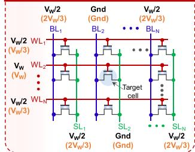
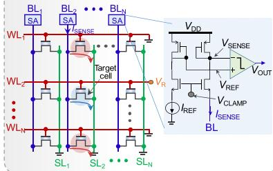
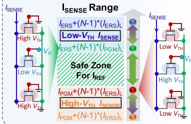
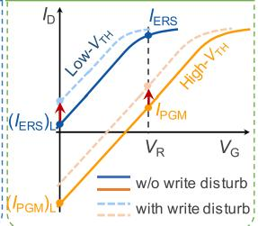
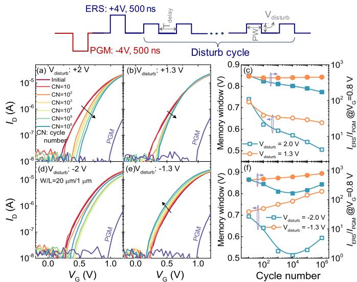
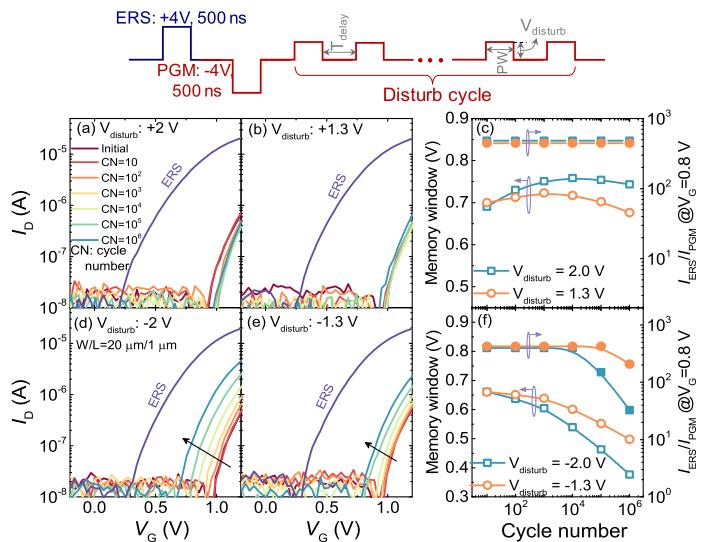
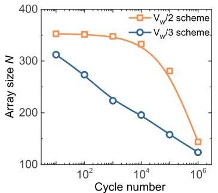

---

title: "Write Disturb in Ferroelectric FETs and Its Implication for 1T-FeFET AND Memory Arrays"
authors:
  - "Kai Ni"
  - "Xueqing Li"
  - "Jeffrey A. Smith"
  - "Matthew Jerry"
  - "Suman Datta"
date: "2018-10-23"
year: "2018"
journal: "IEEE Electron Device Letters"
doi: "10.1109/LED.2018.2872347"
abstract: "In this letter, the write disturb of Hf0.5Zr0.5O2-based 1T-FeFET nonvolatile AND\\"
abstract_cn: "本文研究了 Hf0.5Zr0.5O2 基 1T-FeFET 非易失性 AND 存储阵列在 VW/2 和 VW/3 抑制偏置方案下的写入干扰，以确定最坏情况的存储器感测条件。读余量分析表明，低\\"
keywords:
  - "[[FeFET]]"
  - "[[Write disturb]]"
  - "[[AND array]]"
  - "[[HZO]]"
cite: "[1] Ni K, Li X Q, Smith J A, et al. Write Disturb in Ferroelectric FETs and Its Implication\\"
aiSum: "研究 HZO FeFET AND 阵列写入干扰：分析 VW/2 和 VW/3 抑制方案，发现低 VTH 态漏电流和高 VTH 态读电流增加是限制阵列尺寸的关键因素，为阵列优化提供指导。"
confidence: "high"
wiki_concepts:
  - "[[FeFET]]"
  - "[[HfO2]]"
---

# Write Disturb in [[ferroelectric]] FETs and Its Implication for 1T-[[FeFET]] AND Memory Arrays

Kai Ni , Member, IEEE, Xueqing Li , Member, IEEE, Jeffrey A. Smith, Student Member, IEEE, Matthew Jerry , Student Member, IEEE, and Suman Datta , Fellow, IEEE

Abstract-In this letter, the write disturb of $\mathsf { H f } _ { 0 . 5 } \mathsf { Z r } _ { 0 . 5 } \mathsf { O } _ { 2 ^ { - } }$ based 1T-FeFET nonvolatile AND memory array is experimentally investigated for $V _ { W } / 2$ and $v _ { w } / 3$ inhibition bias schemes to determine the worst-case memory sensing condition. Read margin analysis reveals that the increased leakage current in the low- $\boldsymbol { \cdot } \boldsymbol { v } _ { \mathsf { T H } }$ erased state and the increased read current of the $\mathsf { h i g h } \mathsf { - } V _ { \mathsf { T H } }$ programmed state are the key factors that limit the maximum array size.

Index Terms-HZO, FeFET, memory array, write disturb.

# I. INTRODUCTION

HE excellent scalability and CMOS compatibility of $\mathrm { H f O } _ { 2 }$ -based ferroelectrics elucidates their use in ferroelectric-field-effect-transistors (FeFET) for application in embedded non-volatile memory (NVM) [1], [2]. Ever since the discovery of ferroelectricity in $\mathrm { H f O } _ { 2 } .$ , significant progress has been made in the design and fabrication of FeFET memory.

The major challenges for FeFET memory are the limited endurance of a single cell and write disturb in a 1T-FeFET array. Due to either charge trapping in pre-existing traps and generated defects or dielectric breakdown, $\mathrm { H f O } _ { 2 }$ FeFETs exhibit limited endurance cycles [6], [7]. Strategies to improve endurance have been proposed by increasing the interlayer thickness or distributing the electric field evenly between the ferroelectric and the semiconductor [8], [9].

While the 1T-FeFET memory array is attractive for embedded NVM application for write energy efficiency, high integration density (compared with other embedded NVMs), and non-destructive read, the absence of an additional selection transistor increases its susceptibility to write disturb for the half-selected memory cells in the array. To minimize the disturb effects, inhibition bias schemes such as VW/2 and VW/3 (VW is write pulse amplitude), are usually applied across the half-selected cells during the memory write operation. This disturb effect has been studied with a high VW of 5 V and large pulse width of 10 µs, which exacerbates the write disturb and even causes state collapse [10]. Therefore, it is imperative

Manuscript received September 11, 2018; revised September 22, 2018; accepted September 22, 2018. Date of publication September 27, 2018; date of current version October 23, 2018. This work was supported in part by ASCENT, one of the six centers in JUMP, and in part by a Semiconductor Research Corporation Program sponsored by DARPA and in part by the National Science Foundation of China. The review of this letter was arranged by Editor E. A. Gutiérrez-D. (Corresponding author: Kai Ni.)

K. Ni, J. A. Smith, M. Jerry, and S. Datta are with the Electrical Engineering Department, University of Notre Dame, Notre Dame, IN 46556 USA (e-mail: kni@nd.edu).

X. Li is with Tsinghua University, Beijing 100084, China. Color versions of one or more of the figures in this letter are available online at http://ieeexplore.ieee.org. Digital Object Identifier 10.1109/LED.2018.2872347

to evaluate the write disturb for array-level operation for write pulses with smaller amplitude and shorter duration.

The write disturb effect on how the disturbed memory cells interfere with memory sensing is largely unexplored. It is known that write disturb shifts the device $I _ { \mathrm { D } } \mathrm { - } V _ { \mathrm { G } }$ characteristic, but the key parameters, the cell leakage current or read current, that deteriorate memory sensing need to be identified and is necessary for memory array optimization. Therefore, in this work we emulate the write disturb with 4V 500ns write pulses for the two inhibition bias schemes in a single 1T-FeFET memory cell and study the impact of write disturb on an AND array architecture based on the single cell response.

# II. 1T-FEFET ARRAY

There are a few FeFET memory array topologies [11]. The 1T-FeFET AND array can be more promising than other types of architectures, e.g. NOR array, for embedded NVM applications: (i) The cell size in an AND array is similar to or even smaller than that in a NOR array [12]; (ii) In the AND architecture in Fig.1, the bit-line (BL) and the source-line (SL) are parallel, reducing the write disturb. In contrast, in a NOR array, the WL and SL run parallel, causing all the cells with the same WL (target cells and unselected cells) experience the same write voltage $V _ { \mathrm { { W } _ { \cdot } } }$ exacerbating the write disturb. Additionally, large channel current flows during memory write, increasing the write power consumption in a NOR array [11].

The two inhibition bias schemes, $V _ { \mathrm { W } } / 2$ and $V _ { \mathrm { W } } / 3 .$ , for an AND memory array configuration, are illustrated in Fig. 1 (a). The reduction of disturb voltage amplitude in $V _ { \mathrm { W } } / 3$ scheme comes at the cost of increasing the number of disturbed cells. For the $V _ { \mathrm { W } } / 2$ bias scheme, the half-selected cells (which share either the same WL or the same BL/SL as the target cell) experience a disturb voltage of $V _ { \mathrm { W } } / 2$ while the unselected cells experience no disturb. For $V _ { \mathrm { W } } / 3$ bias scheme, in addition to the half-selected cells, which experience a disturb voltage of $V _ { \mathrm { W } } / 3$ , unselected cells experience disturb voltage of $- V _ { \mathrm { W } } / 3$ .

Disturbed memory cells will interfere with the memory read operation, potentially causing read errors. Fig. 1 (b) shows a typical row-wise current-mode sensing scheme for such an array. Like other current-mode sensing schemes [13], a reference sensing current $I _ { \mathrm { R E F } }$ between $I _ { \mathrm { E R S } }$ and $I _ { \mathrm { P G M } }$ is adopted to determine whether the target cell has a $\mathrm { l o w } \mathrm { - } V _ { \mathrm { T H } }$ state or a high- $V _ { \mathrm { T H } }$ state. The memory read access sensing margin analysis shows the practical ISENSE range (Fig.1 (c)). When accessing a high-VTH state cell, the worst read case corresponds to the cell configuration where all the unselected cells are in the low-VTH state, contributing additional leakage current, $( N { - } 1 ) ^ { * } ( I _ { \mathrm { E R S } } ) _ { \mathrm { L } }$ , for a N -row 1T-FeFET array. As the

  
(a) Inhibition biasschemes

  
(b)Currentsensing ofmemorycell

  
(c) Sensed currentrange

  
(d)Writedisturbforworstread case   
Fig. 1. (a) $V _ { \mathrm { W } } / 2$ (black) and $V _ { \mathrm { W } } / 3$ (yellow) write disturb inhibition bias schemes in an 1T-FeFET AND memory array. Here the target cell is shown in blue circle. For $\dot { V } _ { \mathrm { W } } / 2$ scheme, half-selected cells share either the same WL or the same BL and SL as the target cell experience a disturb voltage of $V _ { \mathrm { W } } / 2$ . For $V _ { \mathrm { W } } / 3$ scheme, in addition to half-selected cells which experience a disturb voltage of $V _ { \mathrm { W } } / 3 ,$ , unselected cells experience a disturb voltage o ${ \mathrm { \Delta } t - } \ l { v _ { \mathrm { W } } } / { \dot { 3 } } .$ . (b) Current-mode memory sensing in an 1T-FeFET memory array. Leakage current from unselected cells in the same column contributes to the total sensed current. (c) Sensed current ISENSE range when reading a high $\bar { V } _ { \mathsf { T H } }$ or low $V _ { \mathsf { T H } }$ device. The cell configuration for worst read situation is also shown. (d) Write disturb effect on FeFET characteristics for the worst read situation.

array size N increases, the leakage current may become larger than the target cell current, IPGM, causing a reduction in sensing margin for a given $I _ { \mathrm { R E F } } .$ The write disturb conditions that increase the IPGM or (IERS)L are of the main interest, as shown in Fig. 1 (d), as they increase the total sensed current ISENSE for high-VTH state sensing and limit the maximum array size N.

When accessing a low- ${ \cal V } _ { \mathrm { T H } }$ state memory cell, the write disturb is less of an issue, as the minimum sensed current corresponds to the cell configuration where all the unselected cells are in high- $V _ { \mathrm { T H } }$ states. The total leakage current, $( N { - } 1 ) ^ { * } ( I _ { \mathrm { P G M } } ) _ { \mathrm { L } }$ , add together with the target cell current IERS. Therefore, the increase of array size N is beneficial for $\mathrm { l o w } \mathrm { - } V _ { \mathrm { T H } }$ state sensing. The degradation in low- $V _ { \mathrm { T H } }$ state sensing comes mainly from the reduction of $I _ { \mathrm { E R S } }$ , which arises only from disturb pulses and is not of concern, as shown in section III. Therefore, we mainly focus on the degradation of IPGM and $( I _ { \mathrm { E R S } } ) _ { \mathrm { L } }$ , which affects the high- $. V _ { \mathrm { T H } }$ state sensing.

Depending on the FeFET initial state, the disturb pulses with different polarities (positive or negative) will have different effects. Two competing mechanisms, polarization switching and charge trapping, collectively determine the disturb effects. For example, positive disturb pulses cause partial polarization switching for the high- $\cdot V _ { \mathrm { T H } }$ state, reducing the device $V _ { \mathrm { T H } }$ while the induced electron trapping in the gate dielectric acts against the polarization and increases the $V _ { \mathrm { T H } }$ [14], [15]. Note that a ferroelectric film contains multiple domains with a distribution of coercive fields, and, hence, the disturb pulses with amplitude smaller than the cumulative coercive voltage can still induce partial polarization switching [16]. In the following, experimental results of write disturb effect on a single cell and its implication on the array size N will be analyzed.

# III. RESULTS AND DISCUSSION

# A. Write Disturb to Cell in Erased State $( L o w \ – V _ { T H } )$

The device under test (DUT) features a gate-last process and a gate stack of $\mathrm { T i N / H f _ { 0 . 5 } Z r _ { 0 . 5 } O _ { 2 } ( 1 0 \ n m ) / S i O _ { 2 } ( 0 . 8 \ n m ) / S i }$ . All the devices have a dimension of $\mathrm { W / L } { = } 2 0 \mu \mathrm { m } / 1 \mu \mathrm { m } \ [ 1 5 ]$ . The write disturb to FeFET in the erased state and its effect on IERS and (IERS)L are emulated by applying gate pulse sequence shown in $\mathrm { F i g . } \ 2 .$ . The delay $T _ { \mathrm { d e l a y } }$ between consecutive disturb pulses is set at 10 ms to minimize the effect of charge trapping on the device state [15]. Note that this emulation probably overestimates the write disturb effect since the memory cells will likely be disturbed by random bipolar pulses (positive or negative) in a real array, instead of identical pulses all the time.

  
Fig. 2. Erased state $I _ { \mathsf { D } } \cdot V _ { \mathsf { G } }$ characteristic evolution with the increase of write disturb cycle number for disturb voltage, $V _ { \mathrm { { d i s t u r b } } \ 0 } { \sf f } \ ( \mathrm {  ~ \ a ~ } ) \ + 2 \ { \sf V } ;$ $\mathrm { ( b ) } + 1 . 3 \ \mathsf { V } ; \mathrm { ( d ) } ^ { - } - 2 \ \mathsf { V } ;$ and (e) −1.3 V. (c)/(f) Memory window and $I _ { E R S } / I _ { \mathsf { P G M } }$ ratio evolution with the cycle number for positive/negative disturb pulse, respectively. All the applied pulses, including the program/erase pulse and the write disturb pulse, have a pulse width of 500 ns. Current measurement noise floor is at $1 0 ^ { - 8 } \mathsf { A } .$

The effects of write disturb on the erased state $I _ { \mathrm { D } ^ { - } } V _ { \mathrm { G } }$ characteristic with disturb voltage of $+ 2 . 0 \mathrm { ~ V ~ }$ and +1.3 V are shown in Fig. 2 (a) and (b). Increasing $V _ { \mathrm { T H } }$ with disturb cycle is indicative of electron trapping induced by the positive disturb pulses, as no polarization switching is happening for low- $V _ { \mathrm { T H } }$ state under positive pulses. In this case, disturb pulses decrease $( I _ { \mathrm { E R S } } ) _ { \mathrm { L } }$ , beneficial for high- $V _ { \mathrm { T H } }$ state sensing. On the other hand, IERS is reduced by $65 \%$ after $1 0 ^ { 6 }$ cycles $\mathrm { f o r } + 2 . 0 \ : \mathrm { V }$ disturb, and remains well above $I _ { \mathrm { R E F } }$ without causing sensing errors (IREF is chosen to be the current at $V _ { \mathrm { G } } = V _ { \mathrm { R } }$ for a $I _ { \mathrm { D } ^ { - } } V _ { \mathrm { G } }$ curve with a $V _ { \mathrm { T H } }$ equal to the average $V _ { \mathrm { T H } }$ of programmed and erased state).

The disturb effect on the erased state with 2.0 V and $- 1 . 3 \mathrm { ~ V ~ }$ pulses is shown in Fig. 2 (d-e-f). The decrease of $V _ { \mathrm { T H } }$ with disturb cycle for −1.3 V results from hole trapping in the gate stack. This improves $I _ { \mathrm { E R S } }$ , but also increases the leakage current (IERS)L, degrading high-VTH state sensing. For disturb voltage of -2.0 V, the device $V _ { \mathrm { T H } }$ increases initially, and then decreases beyond the $1 0 ^ { 4 }$ disturb cycle. This is caused by the competing effects between polarization switching and hole trapping. Initially, the polarization switching dominates, increasing the device $V _ { \mathrm { T H } }$ , while with increasing disturb cycles, hole trapping in the pre-existing and newly generated

  
Fig. 3. Programmed state $I _ { \mathsf { D } } - V _ { \mathsf { G } }$ characteristic evolution with the write disturb cycle number for disturb voltage, $V _ { \mathrm { { d i s t u r b } } }$ of (a) +2 V; (b) +1.3 V; $( { \mathrm { d } } ) - 2 { \dot { \mathsf { V } } } ;$ and (e) −1.3 V. (c)(f) Memory window and IERS/IPGM ratio evolution with the cycle number for positive and negative disturb pulse.

defects finally exceeds the polarization switching induced $V _ { \mathrm { T H } }$ increase. The degradation in $I _ { \mathrm { E R S } }$ (66% after $1 0 ^ { 6 }$ cycles) is small and does not cause any sensing error. In contrast to the continuous $V _ { \mathrm { T H } }$ shift in the tested large devices, it has been shown that the disturb pulses can cause abrupt memory state transition for ultra-scaled devices (28nm FeFET) due to the limited number of domains [17]. Whether the abrupt switching is more detrimental than gradual switching needs further systematic evaluation since the scaled device $V _ { \mathrm { T H } }$ remains unchanged until a threshold number of pulses are applied, suggesting that the array would not be degraded before that critical number. It’s likely that operational and system optimization may benefit from this property.

# B. Write Disturb to Cell in Programmed State $( H i g h - V _ { T H } )$

By applying the gate pulse sequence, shown in $\mathrm { F i g . } \ 3 ,$ the write disturb to the DUT in the programmed state and its effect on $I _ { \mathrm { P G M } }$ are studied. For positive disturb voltages, the device VTH shifts positively in the beginning and then decreases beyond the $\bar { 1 0 ^ { 4 } }$ disturb cycles. This is the result of competition between electron trapping in the gate dielectric and polarization switching. The disturb effect in IPGM is negligible and below the noise floor. Therefore, positive disturb pulse has a negligible effect on the sensing of high-$V _ { \mathrm { T H } }$ state cell. The write disturb with negative pulses to the programmed state, however, is significant, as shown in Fig. 3 (d-e-f). The device $V _ { \mathrm { T H } }$ shift negatively with the disturb cycle due to hole trapping, and thus $I _ { \mathrm { P G M } }$ in the $\mathrm { \hslash { i g h - } } V _ { \mathrm { T H } }$ state increases significantly.

The polarization switching is observed at smaller disturb cycles for negative disturb pulses to low-VTH state, than positive disturb pulses to high- $V _ { \mathrm { T H } }$ state. This is likely related to the ferroelectric electric field asymmetry in the two cases. As the $V _ { \mathrm { T H } }$ is positive for both $\mathrm { l o w } - V _ { \mathrm { T H } }$ and high-VTH states, a larger electric field exists for the case of negative disturb pulse to $\mathrm { l o w } \mathrm { - } V _ { \mathrm { T H } }$ state [15]. Considering the exponential dependence of polarization switching delay on the electric field [18], [19], it is easier to flip the polarization for negative pulses.

  
Fig. 4. Maximum array size N evolution with the disturb cycles for the worst read case of sensing a target cell in the high- $\cdot V _ { \mathsf { T H } }$ state while all the other cells sharing the same bit line are in the low- $\cdot v _ { \mathsf { T H } }$ state. For the analysis, the IREF is chosen to be the current at $V _ { \mathsf { G } } = \dot { V } _ { \mathsf { R } }$ for a $I _ { \mathsf { D } } - V _ { \mathsf { G } }$ with $V _ { \mathsf { T H } }$ equal to the average $V _ { \mathsf { T H } }$ of erased and programmed states. The maximum array size N is determined to satisfy IPGM $+ \left( N - 1 \right) ;$ × $( I _ { \mathsf { E R S } } ) _ { \mathsf { L } } \leq I _ { \mathsf { R E F } }$ , which ensures no sensing errors.

# C. Array Analysis

The response of a single memory cell to write disturb pulses illustrates two write disturb scenarios that would likely cause read errors when sensing a high- $. V _ { \mathrm { T H } }$ state cell for both $V _ { \mathrm { W } } / 3$ and $V _ { \mathrm { W } } / 2$ inhibition schemes. One $\mathrm { i s } - 1 . 3 \mathrm { ~ V ~ }$ disturb to the low- $\cdot V _ { \mathrm { T H } }$ state, which increases $( I _ { \mathrm { E R S } } ) _ { \mathrm { L } } .$ and the other one is −2.0 V disturb to $\mathrm { \hslash { i g h - } } V _ { \mathrm { T H } }$ state, which increases IPGM. Fig. 4 analyzes N as a function of the disturb cycle for the two cases. It is important to note that, unlike a passive [[crossbar]] array [20], the cumulative leakage currents of all unaccessed FeFETs can be further suppressed by applying a negative $V _ { \mathrm { G } } ,$ , such that the array size N can be significantly increased. Without loss of generality, the gate electrodes of unaccessed cells are all grounded here.

An analysis of the impact of $I _ { \mathrm { P G M } }$ increase on the array size N reveals that, for disturb cycle below $1 0 ^ { 3 }$ , N remains unchanged as the IPGM is much smaller than IREF. However, the array size N degrades significantly beyond $1 0 ^ { 3 }$ cycles (60% reduction at $1 \bar { 0 ^ { 6 } }$ cycles). The increase in (IERS)L for $- 1 . 3$ V disturb is monotonic with the disturb cycles. The array size reduces with cycling since the total leakage current, $( N - 1 ) \times ( I _ { \mathrm { E R S } } ) _ { \mathrm { I } }$ , is proportional to (IERS)L.

The increase in both $I _ { \mathrm { P G M } }$ and (IERS)L is caused by hole trapping induced by negative disturb pulses to both the programmed and erased state, which degrades the sensing of memory cell in the $\mathrm { \hslash { i g h - } } V _ { \mathrm { T H } }$ state in an 1T-FeFET array. Therefore, process optimization is necessary to reduce defect density and suppress hole trapping, in order to have a functional and robust 1T-FeFET array. In addition, circuit-level techniques, such as IREF optimization and high-gain lowinput-offset sensing schemes, would be useful for reducing the sensing error rate.

# IV. CONCLUSION

We have demonstrated the write disturb effects in an 1T-FeFET array with $V _ { \mathrm { W } } / 2$ and $V _ { \mathrm { W } } / 3$ inhibition bias schemes. Charge trapping and polarization switching are two competing mechanisms that determine the impact of the disturbs. Worst-case read margin analysis reveals that leakage current increase of the $\mathrm { l o w } - V _ { \mathrm { T H } }$ erased state or the read current increase of the $\mathrm { \hslash { i g h - } } V _ { \mathrm { T H } }$ state current induced by disturb pulses are the limiting factors. This work elucidates the factors that require optimization and tuning for more robust read operations, to address the critical write disturb issue for the design of 1T-FeFET memory array.

# REFERENCES

[1] J. Müller, E. Yurchuk, T. Schlösser, J. Paul, R. Hoffmann, S. Müller, D. Martin, S. Slesazeck, P. Polakowski, J. Sundqvist, M. Czernohorsky, K. Seidel, P. Kücher, R. Boschke, M. Trentzsch, K. Gebauer, U. Schröder, and T. Mikolajick, “Ferroelectricity in [[HfO2]]enables nonvolatile data storage in 28 nm HKMG,” in IEEE VLSI Tech. Dig., Jun. 2012, pp. 25–26, doi: 10.1109/VLSIT.2012.6242443.   
[2] J. Müller, T. S. Böscke, S. Müller, E. Yurchuk, P. Polakowski, J. Paul, D. Martin, T. Schenk, K. Khullar, A. Kersch, W. Weinreich, S. Riedel, K. Seidel, A. Kumar, T. M. Arruda, S. V. Kalinin, T. Schlösser, R. Boschke, R. van Bentum, U. Schröder, and T. Mikolajick, “Ferroelectric [[hafnium oxide]]: A CMOScompatible and highly scalable approach to future ferroelectric memories,” in IEDM Tech. Dig., Dec. 2013, pp. 10.8.1–10.8.4, doi: 10.1109/IEDM.2013.6724605.   
[3] M. Trentzsch, S. Flachowsky, R. Richter, J. Paul, B. Reimer, D. Utess, S. Jansen, H. Mulaosmanovic, S. Müller, S. Slesazeck, J. Ocker, M. Noack, J. Müller, P. Polakowski, J. Schreiter, S. Beyer, T. Mikolajick, and B. Rice, “A 28 nm HKMG super low power embedded NVM technology based on ferroelectric FETs,” in IEEE IEDM Tech. Dig., Dec. 2016, pp. 11.5.1–11.5.4, doi: 10.1109/IEDM.2016.7838397.   
[4] S. Dünkel, M. Trentzsch, R. Richter, P. Moll, C. Fuchs, O. Gehring, M. Majer, S. Wittek, B. Müller, T. Melde, H. Mulaosmanovic, S. Slesazeck, S. Müller, J. Ocker, M. Noack, D.-A. Löhr, P. Polakowski, J. Müller, T. Mikolajick, J. Höntschel, B. Rice, J. Pellerin, and S. Beyer, “A FeFET based super-low-power ultra-fast embedded NVM technology for 22 nm FDSOI and beyond,” in IEDM Tech. Dig., Dec. 2017, pp. 19.7.1–19.7.4.   
[5] N. Gong and T.-P. Ma, “Why is FE–HfO2more suitable than PZT or SBT for scaled nonvolatile 1-T memory cell? A retention perspective,” IEEE Electron Device Lett., vol. 37, no. 9, pp. 1123–1126, Sep. 2016, doi: 10.1109/LED.2016.2593627.   
[6] E. Yurchuk, S. Müller, D. Martin, S. Slesazeck, U. Schröder, T. Mikolajick, J. Müller, J. Paul, R. Hoffmann, J. Sundqvist, T. Schlösser, R. Boschke, R. van Bentum, and M. Trentzsch, “Origin of the endurance degradation in the novel HfO2-based 1T ferroelectric non-volatile memories,” in Proc. IEEE Int. Rel. Phys. Symp., Jun. 2014, pp. 2E.5.1–2E.5.5, doi: 10.1109/ IRPS.2014.6860603.   
[7] N. Gong and T.-P. Ma, “A study of endurance issues in HfO2-based ferroelectric field effect transistors: Charge trapping and trap generation,” IEEE Electron Device Lett., vol. 39, no. 1, pp. 15–18, Jan. 2018, doi: 10.1109/ LED.2017.2776263.   
[8] K. Chatterjee, S. Kim, G. Karbasian, A. J. Tan, A. K. Yadav, A. I. Khan, C. Hu, and S. Salahuddin, “Self-aligned, gate last, FDSOI, ferroelectric gate memory device with 5.5-nm Hf0.8Zr0.2O2, high endurance and breakdown recovery,” IEEE Electron Device Lett., vol. 38, no. 10, pp. 1379–1382, Oct. 2017, doi: 10.1109/LED.2017.2748992.

[9] J. Müller, P. Polakowski, S. Müller, H. Mulaosmanovic, J. Ocker, T. Mikolajick, S. Slesazeck, S. Müller, J. Ocker, T. Mikolajick, S. Flachowsky, and M. Trentzsch, “High endurance strategies for hafnium oxide based ferroelectric field effect transistor,” in Proc. 16th Non-Volatile Memory Technol. Symp., Oct. 2016, pp. 1–7, doi: 10.1109/NVMTS.2016.7781517.   
[10] S. Müller, J. Müller, R. Hoffmann, E. Yurchuk, T. Schlösser, R. Boschke, J. Paul, M. Goldbach, T. Herrmann, A. Zaka, U. Schröder, and T. Mikolajick, “From MFM capacitors toward ferroelectric transistors: Endurance and disturb characteristics ofHfO2-based FeFET devices,” IEEE Trans. Electron Devices, vol. 60, no. 12, pp. 4199–4205, Dec. 2013, doi: 10.1109/TED.2013.2283465.   
[11] M. Ullmann, H. Goebel, H. Hoenigschmid, and T. Haneder, “Disturb free programming scheme for single transistor ferroelectric memory arrays,” Integr. Ferroelect., vol. 34, pp. 155–164, 2001, doi: 10.1080/10584580108012885.   
[12] B. Eitan, R. Kazerounian, A. Roy, G. Crisenza, P. Cappelletti, and A. Modelli, “Multilevel flash cells and their trade-offs,” in IEDM Tech. Dig., Dec. 1996, pp. 169–172, doi: 10.1109/IEDM.1996.553147.   
[13] M.-F. Chang, A. Lee, P.-C. Chen, C. J. Lin, Y.-C. King, S.-S. Sheu, and T.-K. Ku, “Challenges and circuit techniques for energy-efficient on-chip nonvolatile memory using memristive devices,” IEEE Trans. Emerg. Sel. Topics Circuits Syst., vol. 5, no. 2, pp. 183–193, Jun. 2015, doi: 10.1109/JETCAS.2015.2426531.   
[14] E. Yurchuk, J. Müller, S. Müller, J. Paul, M. Peši´c, R. van Bentum, U. Schroeder, and T. Mikolajick, “Charge-trapping phenomena in HfO2-based FeFET-type nonvolatile memories,” IEEE Trans. Electron Devices, vol. 63, no. 9, pp. 3501–3507, Sep. 2016, doi: 10.1109/TED.2016.2588439.   
[15] K. Ni, P. Sharma, J. Zhang, M. Jerry, J. A. Smith, K. Tapily, R. Clark, S. Mahapatra, and S. Datta, “Critical role of interlayer in Hf0.5Zr0.5O2ferroelectric FET nonvolatile memory performance,” IEEE Trans. Electron Devices, vol. 65, no. 6, pp. 2461–2469, Jun. 2018, doi: 10.1109/TED.2018.2829122.   
[16] A. T. Bartic, D. J. Wouters, H. E. Maes, J. T. Rickes, and R. M. Waser, “Preisach model for the simulation of ferroelectric capacitors,” J. Appl. Phys., vol. 89, no. 6, pp. 3420–3425, Mar. 2001, doi: 10.1063/1.1335639.   
[17] H. Mulaosmanovic, T. Mikolajick, and S. Slesazeck, “Accumulative polarization reversal in nanoscale ferroelectric transistors,” ACS Appl. Mater. Interfaces, vol. 10, no. 28, pp. 23997–24002, 2018, doi: 10.1021/acsami.8b08967.   
[18] H. Mulaosmanovic, J. Ocker, S. Müller, U. Schroeder, J. Müller, P. Polakowski, S. Flachowsky, R. Bentum, T. Mikolajick, and S. Slesazeck, “Switching kinetics in nanoscale hafnium oxide based ferroelectric field-effect transistors,” ACS Appl. Mater. Interfaces, vol. 9, no. 4, pp. 3792–3798, 2017, doi: 10.1021/acsami.6b13866.   
[19] K. Ni, M. Jerry, J. A. Smith, and S. Datta, “A circuit compatible accurate compact model for ferroelectric FETs,” in IEEE VLSI Tech. Dig., 2018, pp. 131–132.   
[20] J. Zhou, K. H. Kim, and W. Lu, “Crossbar [[RRAM]] arrays: Selector device requirements during read operation,” IEEE Trans. Electron. Devices, vol. 61, no. 5, pp. 1369–1376, May 2014, doi: 10.1109/TED.2014.2310200.